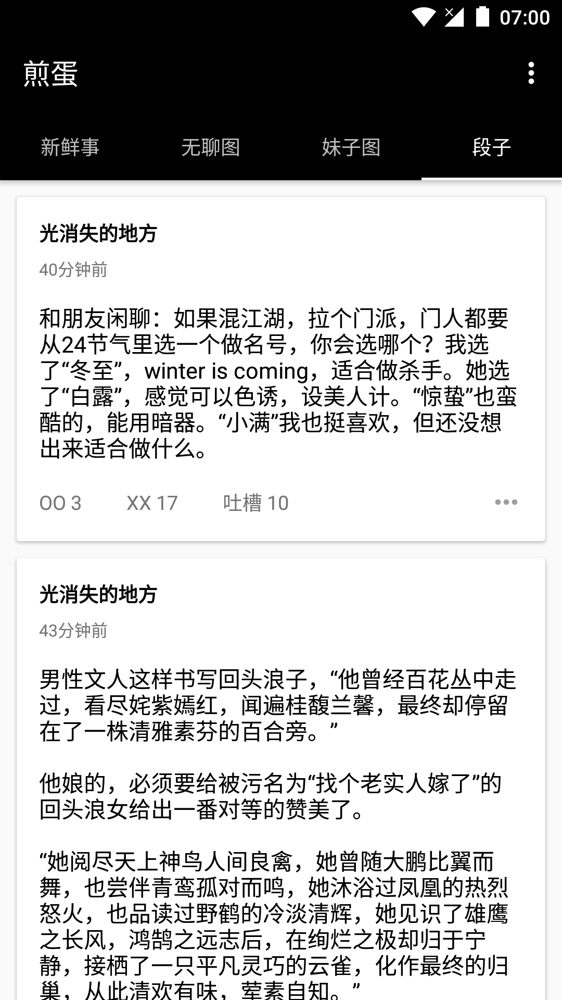
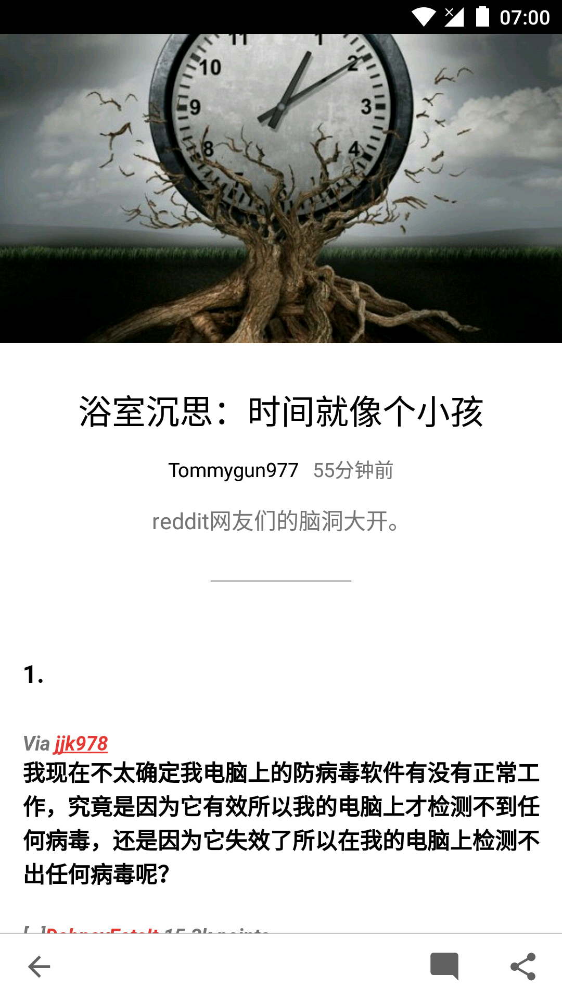
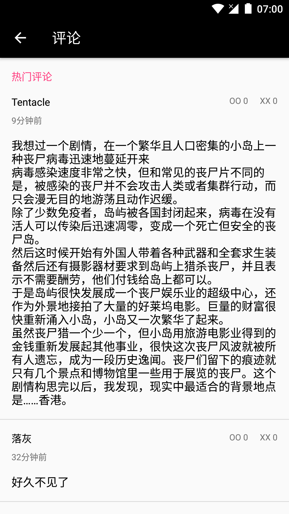

# Jandan-Kotlin
Unofficial Android client of Jandan([煎蛋](http://www.coolapk.com/apk/com.danielstudio.app.wowtu)), implemented using Kotlin.

## Screenshot
  
  
  
## Thanks 
* [VideoListPlayer](https://github.com/waynell/VideoListPlayer)
* [list-visibility-utils](https://github.com/danylovolokh/VideoPlayerManager/tree/master/list-visibility-utils)
* [Jandan Android Client author DanielWangDev](https://m.weibo.cn/u/1749949233)

## 声明
API数据原作公司拥有所有权利，请勿用做商业用途。

## LICENSE
[GPL-3.0](https://github.com/Assassinss/Jandan-Kotlin/blob/master/LICENSE)
